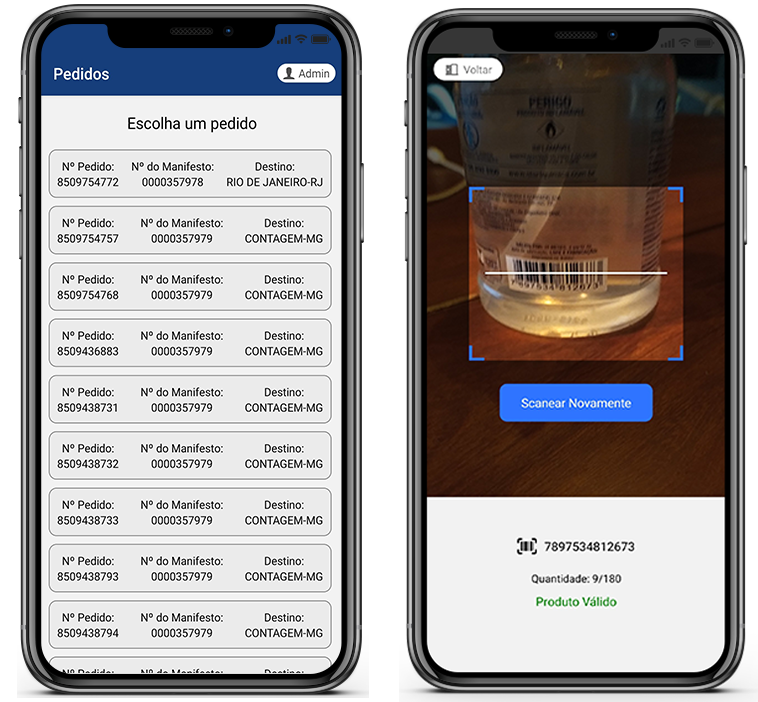

# BarCodeProductValidation
 Aplicativo que auxilia na validação e despacho de produtos com códigos de barras.
 
<h1 align="center">
    
</h1>

## Ideia
 A ideia do aplicativo surgiu a partir de uma conversa com uma pessoa próxima que relatou um problema na empresa que trabalha, em que cargas destinadas para um local acabam indo parar em outro, por conta do processo de verificação da carga ser manual e muito repetitivo.
 
 ## Objetivo da aplicação
 Através do scaneamento do código de barra do produto ou caixa, o aplicativo conectado ao "banco de dados" (JSON) irá validar se aquele produto/caixa é válido para a remessa que está sendo montada no momento.

## Tecnologias
### React-Native e NodeJS.
